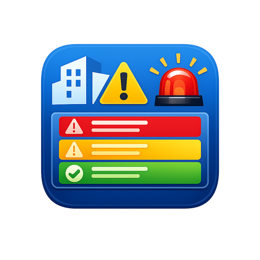

<p align="center">
  
</p>

<h1 align="center">HASS Console</h1>

<p align="center">
  <a href="https://github.com/hacs/integration"></a>
  <a href="https://github.com/Steven-D-Morgan/hass-console/releases"></a>
  <a href="https://github.com/Steven-D-Morgan/hass-console/releases/latest"></a>
  <a href="https://github.com/Steven-D-Morgan/hass-console/releases/latest"></a>
</p>

<p align="center">A Niagara-inspired alarm console and data logger for Home Assistant.<br>Define alarm thresholds and scheduled log snapshots in YAML, acknowledge alarms from the dashboard, and filter everything from a Lovelace card with ALARM and LOG tabs.</p>

If you've used a Niagara AX/N4 alarm console, you know the value of a single pane of glass that shows every alarm and every logged data point across your facility. HASS Console brings that pattern to Home Assistant — threshold-based alarm evaluation with duration requirements, alarm acknowledgment, cron-scheduled data snapshots, severity classification, system categorization, and a sortable/filterable viewer — all driven by one YAML file.

---

## Table of Contents

- [Architecture Overview](#architecture-overview)
- [Installation](#installation)
- [Quick Start](#quick-start)
- [Console.yaml Reference](#consoleyaml-reference)
  - [LOG Points](#log-points--scheduled-data-snapshots)
  - [ALARM Points](#alarm-points--threshold-based-alerts)
- [Alarm Acknowledgment](#alarm-acknowledgment)
- [CSV Output](#csv-output)
- [Lovelace Card](#lovelace-card)
- [Services](#services)
- [Using HASS Console in Automations](#using-hass-console-in-automations)
- [Entity Naming Convention](#entity-naming-convention)
- [Cron Reference](#cron-reference)
- [Real-World Examples](#real-world-examples)
- [Troubleshooting](#troubleshooting)
- [Author & License](#author--license)

---

## Architecture Overview

HASS Console is a custom integration (domain: `hass_console`) with three parts:

```
┌──────────────────────────────────────────────────────────────┐
│  Settings → Devices & Services → HASS Console                │
│    or  configuration.yaml:  hass_console: !include console.yaml
└──────────────┬───────────────────────────────────────────────┘
               │
               ▼
┌──────────────────────────────────────────────────────────────┐
│  HASS Console Engine  (custom_components/hass_console/)      │
│                                                              │
│  ┌─────────────────┐     ┌──────────────────────┐           │
│  │  Cron Scanner    │     │  Alarm Evaluator     │           │
│  │  (every 1 min)   │     │  (state listeners)   │           │
│  │                  │     │                      │           │
│  │  Reads entity →  │     │  Checks threshold →  │           │
│  │  writes LOG row  │     │  tracks duration →   │           │
│  │                  │     │  writes ALARM row    │           │
│  └───────┬──────────┘     └──────────┬───────────┘           │
│          │                           │                       │
│          ▼                           ▼                       │
│  logs.csv       alarms.csv         │
│  /config/www/                /config/www/                    │
└──────────────────────────────────────────────────────────────┘
               │
               ▼
┌──────────────────────────────────────────────────────────────┐
│  HASS Console Card  (www/hass-console-card.js)               │
│                                                              │
│  Fetches both CSVs → tabbed view with filters                │
│  Acknowledge alarms → calls HA service → updates CSV         │
│  Auto-refreshes on configurable interval                     │
└──────────────────────────────────────────────────────────────┘
```

---

## Installation

See [simple-setup.md](simple-setup.md) for the 5-minute walkthrough. The short version:

1. Copy `custom_components/hass_console/` → `/config/custom_components/hass_console/`
2. Copy `www/hass-console-card.js` → `/config/www/hass-console-card.js`
3. Create `/config/console.yaml` with your alarm and log points
4. Restart Home Assistant
5. **Settings → Devices & Services → + Add Integration → HASS Console**
6. Register the card resource → `/local/hass-console-card.js` (JavaScript Module)
7. Add the card to a dashboard

Existing users with `hass_console: !include console.yaml` in `configuration.yaml` can continue using YAML setup — both modes are supported.

---

## Quick Start

Minimum viable `console.yaml`:

```yaml
DAILY_KWH:
  type: LOG
  cron: "0 0 * * *"
  entity: sensor.energy_meter_kwh
  category: E-METER
  note: "Daily kWh snapshot at midnight"

SERVER_ROOM_TEMP:
  type: ALARM
  class: "01"
  category: HVAC
  entity: sensor.server_room_temperature
  note: "Server room overheat"
  trigger:
    - alias: "Above 80°F for 5 min"
      platform: numeric_state
      entity_id: sensor.server_room_temperature
      above: 80
      for:
        minutes: 5
```

After restarting HA, you'll have:
- Entity `hass_console.log_daily_kwh` — updates at midnight with the meter's value
- Entity `hass_console.alarm_server_room_temp` — goes to "ALARM" when triggered
- A row in `logs.csv` every midnight
- A row in `alarms.csv` each time the temperature stays above 80°F for 5+ minutes, starting as unacknowledged

Add the Lovelace card and test immediately with:
```yaml
service: hass_console.write_log
data:
  entity: hass_console.log_test
  category: TEST
  value: "Hello World"
  note: "Testing the console"
```

---

## Console.yaml Reference

Every top-level key defines a **point** — a named data source to watch. The key name becomes part of the entity ID. Each point must have a `type` of either `LOG` or `ALARM`.

---

### LOG Points — Scheduled Data Snapshots

LOG points read an entity's current state on a cron schedule and write it to `logs.csv`.

#### Schema

```yaml
POINT_NAME:
  type: LOG                        # Required
  cron: "0 0 * * *"               # Required — 5-field cron expression
  entity: sensor.some_entity       # Required — entity to read
  category: E-METER                # Optional — system type grouping
  note: "Description"              # Optional — static text for the Note column
```

#### Fields

| Field | Required | Description |
|-------|----------|-------------|
| `type` | Yes | Must be `LOG` |
| `cron` | Yes | 5-field cron expression (when to snapshot). Always wrap in quotes. |
| `entity` | Yes | The HA entity whose `.state` gets logged. |
| `category` | No | System type grouping — HVAC, E-METER, GPS, W-METER, UPS, or any string. Shows as a filterable badge in the card. Defaults to empty. |
| `note` | No | Static text written to the Note column every time this point logs. Defaults to empty. |
| `target_csv` | No | Route this point's entries to a custom CSV file instead of the default log CSV. See [Custom Target Files](#custom-target-files). |

#### How it works

The engine runs a cron scanner every 60 seconds. When the current time matches a LOG point's cron expression, it reads the entity's `.state` and appends a row to the log CSV. Each match produces exactly one row.

#### LOG examples

```yaml
# Daily energy reading at midnight
DAILY_KWH:
  type: LOG
  cron: "0 0 * * *"
  entity: sensor.energy_meter_kwh
  category: E-METER
  note: "Daily kWh snapshot"

# Hourly temperature trend
HOURLY_TEMP:
  type: LOG
  cron: "0 * * * *"
  entity: sensor.outdoor_temperature
  category: HVAC
  note: "Hourly outdoor temp"

# Every 5 minutes — power monitoring
POWER_5MIN:
  type: LOG
  cron: "*/5 * * * *"
  entity: sensor.main_panel_watts
  category: E-METER
  note: "5-min power snapshot"

# Weekly water meter (Monday 8am)
WEEKLY_WATER:
  type: LOG
  cron: "0 8 * * 1"
  entity: sensor.water_meter_gallons
  category: W-METER
  note: "Weekly water usage"

# Vehicle location every 15 minutes
CAR_GPS:
  type: LOG
  cron: "*/15 * * * *"
  entity: device_tracker.my_car
  category: GPS
  note: "Vehicle location"
```

---

### ALARM Points — Threshold-Based Alerts

ALARM points watch entity states in real time and fire when a numeric condition is met for a sustained duration. New alarms start as **unacknowledged** and remain visible until an operator acknowledges them.

#### Schema

```yaml
POINT_NAME:
  type: ALARM                             # Required
  class: "01"                             # Optional — severity (01/02/03)
  category: HVAC                          # Optional — system type grouping
  entity: sensor.some_entity              # Optional — primary entity
  note: "Description"                     # Optional — static Note column text
  trigger:                                # Required — list of triggers
    - alias: "Human-readable description" # Optional — shows in Trigger column
      platform: numeric_state             # Required — numeric_state or state
      entity_id: sensor.some_entity       # Required — entity to monitor
      above: 78                           # numeric_state: fire when > value
      below: 20                           # numeric_state: fire when < value
      to: "on"                            # state: fire when entity changes to this
      from: "off"                         # state: only if previous state was this
      conditions:                         # Optional — AND conditions (all must pass)
        - entity_id: sensor.humidity
          above: 60
      for:                                # Optional — sustained duration
        minutes: 10
```

#### Fields

| Field | Required | Description |
|-------|----------|-------------|
| `type` | Yes | Must be `ALARM` |
| `class` | No | Severity classification. Card color-codes `01` (red/critical), `02` (amber/major), `03` (blue/minor). Any other string gets default styling. |
| `category` | No | System type grouping (HVAC, E-METER, etc.). |
| `entity` | No | The primary entity associated with this alarm. Informational — the actual monitored entity is in the trigger's `entity_id`. |
| `note` | No | Static text written to the Note column when this alarm fires. |
| `target_csv` | No | Route this alarm's entries to a custom CSV file instead of the default alarm CSV. Acknowledgment still works across all alarm files. See [Custom Target Files](#custom-target-files). |
| `trigger` | Yes | List of trigger definitions. Each trigger independently monitors an entity. |

#### Trigger fields

| Field | Required | Description |
|-------|----------|-------------|
| `alias` | No | Human-friendly name shown in the Trigger column. Make it descriptive. |
| `platform` | Yes | `numeric_state` (threshold) or `state` (exact state match). |
| `entity_id` | Yes | The entity to monitor for state changes. |
| `above` | No | **numeric_state only.** Fire when state is strictly greater than this value. |
| `below` | No | **numeric_state only.** Fire when state is strictly less than this value. At least one of `above`/`below` required for numeric_state. |
| `to` | No | **state only.** Fire when entity state matches this value. Accepts a single value or a list. |
| `from` | No | **state only.** Only fire if the previous state matches. Accepts a single value or a list. |
| `conditions` | No | List of AND conditions. All must be true simultaneously for the alarm to fire. See [Multi-Condition AND Logic](#multi-condition-and-logic). |
| `for` | No | How long the condition must hold before firing. Prevents nuisance alarms. Works with both platforms. |

#### How alarm evaluation works

1. The engine subscribes to `state_changed` events on the trigger's `entity_id`.
2. On each state change, it checks the primary condition based on the platform:
   - **numeric_state** — is the value above/below the threshold?
   - **state** — does the new state match `to`? Was the old state in `from` (if specified)?
3. If the primary condition passes AND all `conditions` are also true, the alarm condition is considered met.
4. If the condition was not previously met, it starts a duration timer.
5. If the condition holds for the `for` duration, it writes an ALARM row (unacknowledged).
6. If the condition clears, the timer resets — ready for the next incident.

**One alarm per incident.** A sustained 2-hour overheat produces one row, not continuous repeats. When the value drops back below threshold and exceeds it again, that's a new incident.

---

### Multi-Condition AND Logic

Any trigger can include a `conditions` list. The primary trigger must fire AND all conditions must pass simultaneously for the alarm to record. Conditions are checked against the current state of their entity at the moment the primary trigger fires.

#### Condition fields

| Field | Type | Description |
|-------|------|-------------|
| `entity_id` | Required | The entity to check. |
| `above` | Numeric | Passes if entity state > value. |
| `below` | Numeric | Passes if entity state < value. |
| `state` | String/List | Passes if entity state matches (exact). |

Combine `above` and `below` for a range check. Use `state` for exact matches. You can mix trigger platforms with any condition type.

#### Examples

```yaml
# Numeric trigger + numeric condition (both must be true)
HOT_AND_HUMID:
  type: ALARM
  class: "02"
  category: HVAC
  trigger:
    - alias: "Temp >80 AND humidity >60% for 10 min"
      platform: numeric_state
      entity_id: sensor.server_room_temperature
      above: 80
      conditions:
        - entity_id: sensor.server_room_humidity
          above: 60
      for:
        minutes: 10

# State trigger + numeric condition
DOOR_OPEN_WHILE_HOT:
  type: ALARM
  class: "01"
  category: SECURITY
  trigger:
    - alias: "Door opened while temp >85"
      platform: state
      entity_id: binary_sensor.server_room_door
      to: "on"
      conditions:
        - entity_id: sensor.server_room_temperature
          above: 85

# Numeric trigger + state condition
POWER_HIGH_WHILE_AWAY:
  type: ALARM
  class: "02"
  category: E-METER
  trigger:
    - alias: "Above 5kW while nobody home for 15 min"
      platform: numeric_state
      entity_id: sensor.main_panel_watts
      above: 5000
      conditions:
        - entity_id: person.steven
          state: "not_home"
      for:
        minutes: 15

# Multiple AND conditions
CRITICAL_ENVIRONMENT:
  type: ALARM
  class: "01"
  trigger:
    - alias: "Temp >90 AND humid >70 AND door open"
      platform: numeric_state
      entity_id: sensor.rack_temperature
      above: 90
      conditions:
        - entity_id: sensor.rack_humidity
          above: 70
        - entity_id: binary_sensor.rack_door
          state: "on"
      for:
        minutes: 5
```

#### ALARM examples

```yaml
# Critical — server room overheat
RACK_OVERHEAT:
  type: ALARM
  class: "01"
  category: HVAC
  entity: sensor.rack_inlet_temperature
  note: "Rack inlet overheating"
  trigger:
    - alias: "Above 85°F for 5 min"
      platform: numeric_state
      entity_id: sensor.rack_inlet_temperature
      above: 85
      for:
        minutes: 5

# Major — freezer failure
GARAGE_FREEZER:
  type: ALARM
  class: "02"
  category: HVAC
  entity: sensor.garage_freezer_temperature
  note: "Garage freezer temp rising"
  trigger:
    - alias: "Above 10°F for 30 min"
      platform: numeric_state
      entity_id: sensor.garage_freezer_temperature
      above: 10
      for:
        minutes: 30

# Minor — UPS low battery
UPS_LOW:
  type: ALARM
  class: "03"
  category: UPS
  entity: sensor.ups_battery_level
  note: "UPS battery low"
  trigger:
    - alias: "Below 20% for 5 min"
      platform: numeric_state
      entity_id: sensor.ups_battery_level
      below: 20
      for:
        minutes: 5

# Immediate — power spike (no duration)
POWER_SPIKE:
  type: ALARM
  class: "01"
  category: E-METER
  entity: sensor.main_panel_watts
  note: "Power spike"
  trigger:
    - alias: "Above 10kW (immediate)"
      platform: numeric_state
      entity_id: sensor.main_panel_watts
      above: 10000

# Multiple triggers on one alarm
HUMIDITY_BAND:
  type: ALARM
  class: "02"
  category: HVAC
  entity: sensor.server_room_humidity
  note: "Humidity out of range"
  trigger:
    - alias: "Above 60% RH for 15 min"
      platform: numeric_state
      entity_id: sensor.server_room_humidity
      above: 60
      for:
        minutes: 15
    - alias: "Below 30% RH for 15 min"
      platform: numeric_state
      entity_id: sensor.server_room_humidity
      below: 30
      for:
        minutes: 15

# State trigger — garage door left open
GARAGE_DOOR:
  type: ALARM
  class: "02"
  category: SECURITY
  entity: binary_sensor.garage_door
  note: "Garage door left open"
  trigger:
    - alias: "Open for 5 min"
      platform: state
      entity_id: binary_sensor.garage_door
      to: "on"
      for:
        minutes: 5

# State trigger — specific transition
WASHER_DONE:
  type: ALARM
  class: "03"
  category: APPLIANCE
  trigger:
    - alias: "Washer finished"
      platform: state
      entity_id: sensor.washer_status
      to: "complete"
      from: "running"

# State trigger — device offline
SERVER_OFFLINE:
  type: ALARM
  class: "01"
  category: NETWORK
  trigger:
    - alias: "Offline for 2 min"
      platform: state
      entity_id: binary_sensor.server_ping
      to: "off"
      for:
        minutes: 2
```

---

## Custom Target Files

By default, all LOG points write to `logs.csv` and all ALARM points write to `alarms.csv`. The optional `target_csv` field routes a point's entries to a separate file instead — useful for keeping a specific subsystem's data isolated (e.g. all electrical meter readings in their own file for billing reconciliation).

### Path resolution

| `target_csv` value | Resolves to | Accessible at |
|--------------------|-------------|---------------|
| `electrical_meters.csv` | `/config/www/hass-console/electrical_meters.csv` | `/local/hass-console/electrical_meters.csv` |
| `subfolder/meters.csv` | `/config/www/hass-console/subfolder/meters.csv` | `/local/hass-console/subfolder/meters.csv` |
| `/config/logs/meters.csv` | `/config/logs/meters.csv` | (not web-accessible) |

A bare filename lands next to the default CSVs (in `/config/www/hass-console/`) so it's reachable at a `/local/hass-console/` URL. An absolute path is used as-is.

### Example

```yaml
# Both of these write to electrical_meters.csv instead of the default log file
MAIN_PANEL_KWH:
  type: LOG
  cron: "0 * * * *"
  entity: sensor.main_panel_kwh
  category: E-METER
  target_csv: electrical_meters.csv
  note: "Main panel hourly kWh"

SUBPANEL_KWH:
  type: LOG
  cron: "0 * * * *"
  entity: sensor.subpanel_kwh
  category: E-METER
  target_csv: electrical_meters.csv
  note: "Subpanel hourly kWh"
```

The custom file uses the same schema as the default file for its type (LOG or ALARM columns), is auto-created with headers, and is migrated automatically if the schema changes.

### Custom files and ALARM points

`target_csv` works for ALARM points too. Acknowledgment still works seamlessly — the acknowledge services search across every alarm file in use, so an alarm in `hvac_alarms.csv` can be acknowledged exactly like one in the default file.

### Viewing custom files in the card

The main card shows the default alarm and log CSVs. To view a custom file, add a second card instance pointing at it:

```yaml
type: custom:hass-console-card
title: Electrical Meters
log_csv: /local/hass-console/electrical_meters.csv
alarm_csv: /local/hass-console/alarms.csv
```

The card always renders both tabs, so set `log_csv` (or `alarm_csv`) to your custom file and leave the other pointing at a default.

---

## Alarm Acknowledgment

HASS Console follows the Niagara alarm acknowledgment model: alarms arrive as unacknowledged and stay visible until an operator acknowledges them.

### How it works

```
Alarm fires → written to CSV with ack="" (unacknowledged)
    ↓
Appears in the Alarm tab (default view = unacknowledged only)
    ↓
Operator clicks ACK → service updates CSV → row disappears from default view
    ↓
Toggle "Show ACK'd" → acknowledged rows visible (dimmed, green ✓ with timestamp)
```

### Card controls

| Control | Location | Behavior |
|---------|----------|----------|
| **ACK button** | Per alarm row | Acknowledges that single alarm |
| **ACK All (N)** | Toolbar | Acknowledges all unacknowledged alarms in one click |
| **Show ACK'd / Hide ACK'd** | Toolbar toggle | Shows or hides acknowledged alarms |
| **Unack count badge** | Alarm tab label | Red badge showing the number of unacknowledged alarms |
| **Row counter** | Footer | Shows `"12 rows (8 ack'd hidden)"` when filtering |

### From automations

```yaml
# Acknowledge a specific alarm by its ID
service: hass_console.acknowledge_alarm
data:
  id: "a1b2c3d4"

# Acknowledge all open alarms
service: hass_console.acknowledge_all
```

### In the CSV

The `ack` column is empty for unacknowledged alarms and contains the acknowledgment timestamp (`YYYY-MM-DD HH:MM:SS`) for acknowledged ones. The `id` column is a unique 8-character hex string generated per alarm.

---

## CSV Output

Two separate CSV files in `/config/www/`, accessible at `/local/` URLs:

### alarms.csv

```
id, timestamp, category, entity, class, value, duration, note, trigger, ack, ack_note
```

| Column | Description |
|--------|-------------|
| id | Unique 8-char hex ID for this alarm |
| timestamp | `YYYY-MM-DD HH:MM:SS` when the alarm fired (local time) |
| category | System type (HVAC, E-METER, etc.) |
| entity | HASS Console entity ID |
| class | Severity class (01, 02, 03, etc.) |
| value | Entity state when the alarm fired |
| duration | How long the condition held before firing |
| note | Static note from config |
| trigger | Alias of the trigger that fired |
| ack | Empty = unacknowledged, timestamp = when acknowledged |
| ack_note | Optional note supplied when acknowledging (shown on hover over the ✓ in the card) |

### logs.csv

```
timestamp, category, entity, value, note
```

| Column | Description |
|--------|-------------|
| timestamp | `YYYY-MM-DD HH:MM:SS` when the snapshot was taken |
| category | System type |
| entity | HASS Console entity ID |
| value | Entity state at time of log |
| note | Static note from config |

### Automatic migration

On every startup, the engine checks existing CSV headers against the current schema. If columns are missing (e.g., upgrading from an older version), it rewrites the file with the new columns, filling existing rows with empty values and generating IDs where needed. No data loss.

### Retention & rotation

By default HASS Console keeps everything forever. Two optional settings (Settings → Devices &
Services → HASS Console → **Configure**) bound file growth so acknowledgment and the card stay
fast on long-running installs:

| Setting | Default | Description |
|---------|---------|-------------|
| `retention_days` | `0` (keep forever) | Rows older than this many days are pruned by a daily task. |
| `max_rows` | `0` (unlimited) | Each file is trimmed to its newest N rows. |

**Unacknowledged alarms are never pruned**, regardless of age or the row cap — only acknowledged
alarms and log rows age out. Both settings apply to every CSV in use, including custom
`target_csv` files. Retention is opt-in: with both at `0`, nothing is ever deleted.

> **Future: SQLite backend.** For very large datasets (years of high-frequency logs), a SQLite
> store is the planned next step — acknowledgment becomes a single indexed `UPDATE` and filtering
> is done in the database rather than by rewriting a file. Retention/rotation covers the CSV case
> until then.

---

## Lovelace Card

### Configuration

```yaml
type: custom:hass-console-card
title: HASS Console
alarm_csv: /local/hass-console/alarms.csv
log_csv: /local/hass-console/logs.csv
rows: 200
refresh_interval: 30
theme: auto
show_alarm: true
show_log: true
```

| Key | Default | Description |
|-----|---------|-------------|
| `title` | HASS Console | Card header text |
| `alarm_csv` | `/local/hass-console/alarms.csv` | URL to alarm CSV |
| `log_csv` | `/local/hass-console/logs.csv` | URL to log CSV |
| `rows` | 200 | Max rows to display per tab |
| `refresh_interval` | 30 | Seconds between auto-refresh |
| `theme` | auto | `auto` (follows HA theme), `dark`, or `light` |
| `show_alarm` | true | Set to `false` to hide the Alarm tab |
| `show_log` | true | Set to `false` to hide the Log tab |

### Theme Support

The card adapts to Home Assistant's active theme. In `auto` mode, it reads HA's background color to determine light or dark, then sets all colors, backgrounds, and borders to match. Alarm severity colors (red/amber/blue) stay fixed in both modes for visual consistency.

- **`auto`** — detects HA's current theme. If you switch between light and dark in HA, the card follows.
- **`dark`** — forces the dark console look regardless of HA theme. The original HASS Console aesthetic.
- **`light`** — forces light mode. Clean white background with dark text.

### Show/Hide Tabs

Use `show_alarm: false` or `show_log: false` to create single-purpose card instances. When only one tab is enabled, the tab bar hides entirely for a cleaner view.

```yaml
# Alarm-only view
type: custom:hass-console-card
title: Alarms Only
show_log: false

# Log-only view for a custom target CSV
type: custom:hass-console-card
title: Electrical Meters
show_alarm: false
log_csv: /local/hass-console/electrical_meters.csv
```

### Features

**Tabs** — ALARM and LOG tabs. The alarm tab badge shows the unacknowledged alarm count in red.

**Alarm acknowledgment** — ACK button per row, ACK All in toolbar, Show/Hide ACK'd toggle. Default view hides acknowledged alarms.

**Collapsible filter panel** (⚙ Filters):
- **Alarm Class** — chip toggles for 01 Critical (red), 02 Major (amber), 03 Minor (blue). Alarm tab only.
- **Category** — chip toggles for each distinct category (HVAC, E-METER, GPS, etc.).
- **Entity** — chip toggles for each distinct entity.
- **Date Range** — from/to date pickers plus presets: Today, Last 7d, Last 30d, This Month.
- **Clear All Filters** — one click reset.

**Text search** — matches all columns simultaneously.

**Sortable columns** — click any header. Active sort shows ▲/▼.

**Active filter tags** — removable tags in the footer.

**CSV download** — opens the raw CSV for the active tab.

**Auto-refresh** — configurable interval, shows "Refreshed" timestamp.

All filters stack — class + category + entity + date range + text search.

---

## Summary Card

A compact at-a-glance widget for overview dashboards. Shows alarm counts by severity, acknowledgment status, and a 7-day alarm trend sparkline.

### Setup

Register as a second resource: **Settings → Dashboards → Resources → Add Resource**

| Field | Value |
|-------|-------|
| URL   | `/local/hass-console-summary-card.js` |
| Type  | JavaScript Module |

### Configuration

```yaml
type: custom:hass-console-summary-card
title: Console Status
alarm_csv: /local/hass-console/alarms.csv
log_csv: /local/hass-console/logs.csv
refresh_interval: 30
theme: auto
show_trend: true
show_log_count: true
```

| Key | Default | Description |
|-----|---------|-------------|
| `title` | Console Status | Card header text |
| `alarm_csv` | `/local/hass-console/alarms.csv` | URL to alarm CSV |
| `log_csv` | `/local/hass-console/logs.csv` | URL to log CSV |
| `refresh_interval` | 30 | Seconds between auto-refresh |
| `theme` | auto | `auto`, `dark`, or `light` |
| `show_trend` | true | Show the 7-day alarm trend sparkline |
| `show_log_count` | true | Show total log entry count in stats |

### What it shows

**Status indicator** — a glowing dot and label that reflects the highest active severity: CRITICAL (red, blinking), ATTENTION (amber), MINOR (blue), or ALL CLEAR (green). Determined by unacknowledged alarms only.

**Severity gauges** — large numbers for Critical, Major, and Minor unacknowledged alarm counts. An "Other" gauge appears if you use custom class values beyond 01/02/03.

**Stats row** — unacknowledged count, acknowledged count, total alarms, and total log entries.

**7-day alarm trend** — a sparkline bar chart showing alarm volume per day for the last week. Bar color scales from green (low) to amber to red (high). Hover a bar to see the exact date and count. Useful for spotting patterns — are alarms increasing? Did something change on Tuesday?

---

## Services

### hass_console.write_log

Manually inject a LOG entry.

```yaml
service: hass_console.write_log
data:
  entity: "hass_console.log_custom"
  category: "HVAC"
  value: "72.5"
  note: "Manual reading"
```

| Field | Required | Description |
|-------|----------|-------------|
| entity | Yes | Entity name (freeform string) |
| category | No | System type |
| value | No | Value to record |
| note | No | Description |
| target_csv | No | Custom CSV filename or absolute path |

### hass_console.write_alarm

Manually inject an ALARM entry (starts as unacknowledged).

```yaml
service: hass_console.write_alarm
data:
  entity: "hass_console.alarm_manual"
  category: "HVAC"
  class: "02"
  value: "OPEN"
  note: "Garage door left open"
  trigger: "Manual observation"
```

| Field | Required | Description |
|-------|----------|-------------|
| entity | Yes | Entity name |
| category | No | System type |
| class | No | Severity class |
| value | No | Value/state |
| duration | No | Duration string |
| note | No | Description |
| trigger | No | What caused the alarm |
| target_csv | No | Custom CSV filename or absolute path |

### hass_console.acknowledge_alarm

Acknowledge a single alarm by its ID.

```yaml
service: hass_console.acknowledge_alarm
data:
  id: "a1b2c3d4"
```

| Field | Required | Description |
|-------|----------|-------------|
| id | Yes | The alarm's unique ID (from the CSV `id` column) |
| note | No | Optional acknowledgment note |

### hass_console.acknowledge_all

Acknowledge all unacknowledged alarms at once.

```yaml
service: hass_console.acknowledge_all
```

| Field | Required | Description |
|-------|----------|-------------|
| note | No | Optional acknowledgment note |

### hass_console.reload

Reload the engine — re-reads `console.yaml` and restarts all listeners. No HA restart needed.

```yaml
service: hass_console.reload
```

---

## Using HASS Console in Automations

### Log a door open event as an alarm

```yaml
automation:
  - alias: "Console — Garage door alarm"
    trigger:
      - platform: state
        entity_id: binary_sensor.garage_door
        to: "on"
    action:
      - service: hass_console.write_alarm
        data:
          entity: hass_console.alarm_garage_door
          category: SECURITY
          class: "02"
          value: "OPEN"
          note: "Garage door opened"
          trigger: "binary_sensor.garage_door → on"
```

### Log daily HVAC runtime

```yaml
automation:
  - alias: "Console — HVAC runtime at midnight"
    trigger:
      - platform: time
        at: "23:59:00"
    action:
      - service: hass_console.write_log
        data:
          entity: hass_console.log_hvac_runtime
          category: HVAC
          value: "{{ states('sensor.hvac_total_runtime_today') }}"
          note: "End-of-day HVAC runtime"
```

### Auto-acknowledge alarms at shift change

```yaml
automation:
  - alias: "Console — Auto-ACK at 7am"
    trigger:
      - platform: time
        at: "07:00:00"
    action:
      - service: hass_console.acknowledge_all
```

### Acknowledge a specific alarm from a notification action

```yaml
automation:
  - alias: "Console — ACK from phone notification"
    trigger:
      - platform: event
        event_type: mobile_app_notification_action
        event_data:
          action: ACK_ALARM
    action:
      - service: hass_console.acknowledge_alarm
        data:
          id: "{{ trigger.event.data.alarm_id }}"
```

### Log internet speed test results

```yaml
automation:
  - alias: "Console — Speed test log"
    trigger:
      - platform: state
        entity_id: sensor.speedtest_download
    action:
      - service: hass_console.write_log
        data:
          entity: hass_console.log_speedtest
          category: NETWORK
          value: "{{ states('sensor.speedtest_download') }} down / {{ states('sensor.speedtest_upload') }} up"
          note: "Speed test result"
```

---

## Entity Naming Convention

```
hass_console.<type>_<point_name_in_lowercase>
```

| YAML Key | Type | Entity ID |
|----------|------|-----------|
| `DAILY_KWH` | LOG | `hass_console.log_daily_kwh` |
| `TEMPERATURE_ALARM` | ALARM | `hass_console.alarm_temperature_alarm` |
| `WEEKLY_WATER` | LOG | `hass_console.log_weekly_water` |
| `UPS_LOW` | ALARM | `hass_console.alarm_ups_low` |

These are real HA entities — usable in automations, Lovelace cards, history graphs, etc. They
are created at startup (so they exist before the first log/alarm fires), carry unique IDs and
registry entries (renameable/manageable in the UI), and **restore their last value across
Home Assistant restarts**.

---

## Cron Reference

```
┌───────────── minute (0-59)
│ ┌───────────── hour (0-23)
│ │ ┌───────────── day of month (1-31)
│ │ │ ┌───────────── month (1-12)
│ │ │ │ ┌───────────── day of week (0-6, Sunday=0)
│ │ │ │ │
* * * * *
```

| Syntax | Meaning |
|--------|---------|
| `*` | Every value |
| `5` | Specific value |
| `1,15` | Multiple values |
| `1-5` | Range |
| `*/10` | Every Nth value |

| Expression | Schedule |
|------------|----------|
| `"0 0 * * *"` | Daily at midnight |
| `"0 * * * *"` | Every hour |
| `"*/5 * * * *"` | Every 5 minutes |
| `"*/15 * * * *"` | Every 15 minutes |
| `"0 8 * * 1"` | Monday at 8 AM |
| `"0 0 1 * *"` | 1st of month at midnight |
| `"0 6,18 * * *"` | 6 AM and 6 PM |
| `"0 0 * * 1-5"` | Weekdays at midnight |
| `"0 */4 * * *"` | Every 4 hours |

Always wrap cron expressions in quotes in YAML.

**Timezone.** Cron expressions are evaluated in Home Assistant's configured local timezone —
`"0 0 * * *"` fires at your local midnight.

**Name aliases.** Months (`jan`–`dec`) and weekdays (`sun`–`sat`) may be used in place of
numbers, and `7` is accepted as Sunday. Examples: `"0 9 * * mon-fri"`, `"0 0 1 jan,jul *"`.

**Day-of-month vs day-of-week.** Following standard (Vixie) cron: when **both** the
day-of-month and day-of-week fields are restricted (neither is `*`), the schedule fires when
**either** matches. If only one is restricted, only that field must match.

---

## Real-World Examples

### Home energy monitoring

```yaml
DAILY_KWH:
  type: LOG
  cron: "0 0 * * *"
  entity: sensor.grid_consumption_kwh
  category: E-METER
  note: "Daily grid consumption"

DAILY_SOLAR:
  type: LOG
  cron: "0 0 * * *"
  entity: sensor.solar_production_kwh
  category: E-METER
  note: "Daily solar production"

HOURLY_DEMAND:
  type: LOG
  cron: "0 * * * *"
  entity: sensor.main_panel_watts
  category: E-METER
  note: "Hourly demand reading"

HIGH_DEMAND:
  type: ALARM
  class: "01"
  category: E-METER
  entity: sensor.main_panel_watts
  note: "Excessive power draw"
  trigger:
    - alias: "Above 8kW for 5 min"
      platform: numeric_state
      entity_id: sensor.main_panel_watts
      above: 8000
      for:
        minutes: 5

BATTERY_LOW:
  type: ALARM
  class: "03"
  category: E-METER
  entity: sensor.powerwall_battery_level
  note: "Home battery low"
  trigger:
    - alias: "Below 15% for 10 min"
      platform: numeric_state
      entity_id: sensor.powerwall_battery_level
      below: 15
      for:
        minutes: 10
```

### Server room monitoring

```yaml
TEMP_15MIN:
  type: LOG
  cron: "*/15 * * * *"
  entity: sensor.rack_inlet_temperature
  category: HVAC
  note: "Rack inlet temp"

OVERHEAT:
  type: ALARM
  class: "01"
  category: HVAC
  entity: sensor.rack_inlet_temperature
  note: "Rack inlet overheating"
  trigger:
    - alias: "Above 85°F for 5 min"
      platform: numeric_state
      entity_id: sensor.rack_inlet_temperature
      above: 85
      for:
        minutes: 5

UPS_CRITICAL:
  type: ALARM
  class: "01"
  category: UPS
  entity: sensor.ups_battery_percent
  note: "UPS battery critical"
  trigger:
    - alias: "Below 10% for 2 min"
      platform: numeric_state
      entity_id: sensor.ups_battery_percent
      below: 10
      for:
        minutes: 2
```

---

## Troubleshooting

**No CSV files created** — The engine creates CSVs on first startup. Check that `/config/www/` exists. Look at the HA log for `hass_console` entries.

**Cron not firing** — Wrap cron expressions in quotes in YAML. The scanner runs every 60 seconds so there can be up to a 60-second delay. Enable debug logging:
```yaml
logger:
  logs:
    custom_components.hass_console: debug
```

**Alarm not triggering** — Verify the entity reports a numeric state (check Developer Tools → States). `unavailable` and `unknown` states are skipped. Make sure `entity_id` inside the trigger matches the real entity.

**Card shows "No entries yet"** — Click ↻ Refresh. Verify the CSV URLs in the card config. Open the URL directly in a browser to check the file.

**Card not loading** — Verify the resource is registered (Settings → Dashboards → Resources) with type "JavaScript Module". Hard refresh (Ctrl+Shift+R).

**Config flow 500 error** — Restart HA after copying the integration files. The config flow requires a full restart to register.

**ACK button not working** — The card calls `hass_console.acknowledge_alarm` via the HA service API. Verify the service is registered in Developer Tools → Services.

**Reloading after config changes** — Use the ⋮ → Reload menu on the integration card, or call `hass_console.reload` from Developer Tools → Services.

---

## Author & License

Created and maintained by [Steven D. Morgan](https://github.com/Steven-D-Morgan).

MIT License — see [LICENSE](LICENSE) for details.
